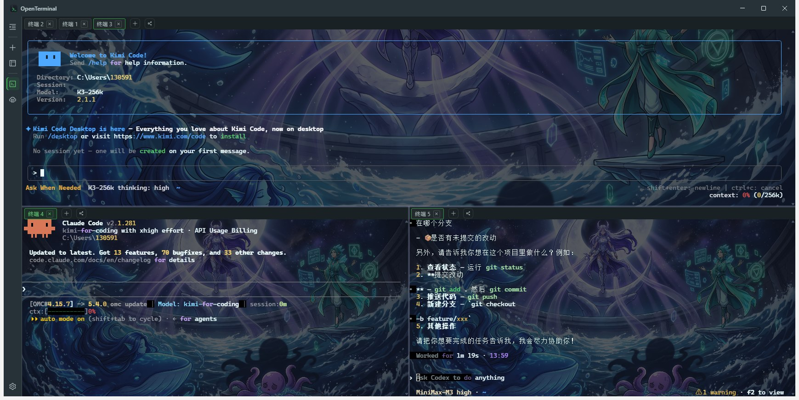
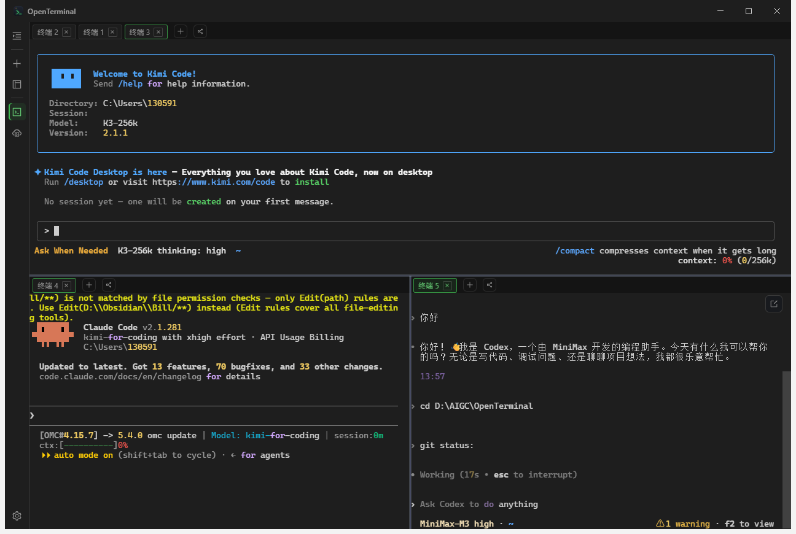
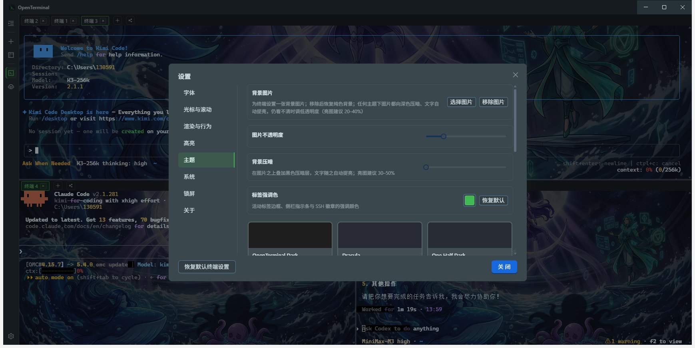
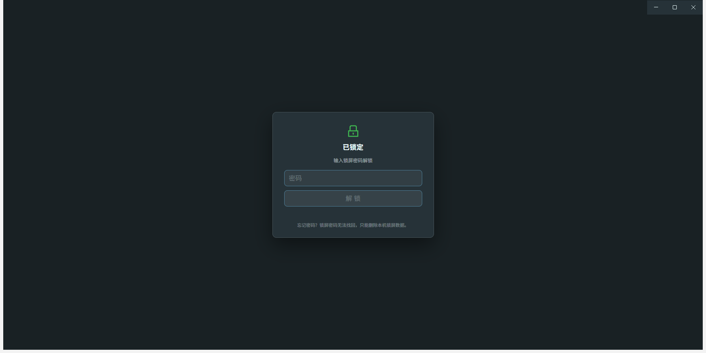

# OpenTerminal

开源的现代化终端应用：本地终端 + SSH 远程会话 + 分屏管理 + 主题/字体定制。Electron + React + TypeScript，从 0 到 1 独立开发。

> 产品官网（GitHub Pages）：<https://billowliu2.github.io/OpenTerminal/>，源码在 [`website/`](website/)。

## 截图

| 多路分屏并行 AI 编程 Agent | 无背景图的干净分屏 |
| --- | --- |
|  |  |

| 主题与个性化（背景图 / 不透明度 / 压暗层） | 锁屏（Ctrl+L，遮罩下会话不断线） |
| --- | --- |
|  |  |

## 优势

- **轻量**：渲染层依赖全量打包进 bundle、不重复进安装包，应用本体 asar 仅 8.1MB，NSIS 安装包约 109MB；单一 exe 安装包，应用内自动更新
- **隐私与安全**：SSH 凭据经 DPAPI 加密落盘、渲染层接触不到明文；锁屏密码只存 scrypt 派生值；SFTP/ZMODEM 的本地路径必须经系统对话框授权，阻断构造路径读写
- **性能**：xterm.js WebGL 渲染；关键词高亮引擎实测 0.02–0.05ms/KB（200KB 混合输出 4–9ms）；SFTP 大目录虚拟滚动；分屏尺寸去抖同步，TUI 不反复重绘
- **AI 编程友好**：为 Kimi Code / Claude Code / Codex 等高频刷新 TUI 优化；中文输入法候选窗紧贴光标
- **国内可用**：更新检查 GitHub 优先（跟随系统代理），失败自动回退国内直连通道，两边都拿不到时 30s 整体超时兜底
- **开源可审计**：MIT 协议；主/预载/渲染三端契约集中在 `src/shared/`，模块间零横向依赖；19 个离线测试覆盖存储、锁屏、高亮、传输与更新回退

## 快速开始

```bash
npm install        # 已安装可跳过
npm run dev        # 开发模式（热更新）
npm run build      # 生产构建到 out/
npm run typecheck  # 全量类型检查
npm test           # 先自动跑 typecheck，再重建测试 bundle 并跑 19 个离线测试（详见「测试」）
```

> Electron 二进制下载失败时：`ELECTRON_MIRROR=https://npmmirror.com/mirrors/electron/ node node_modules/electron/install.js`

## 功能

**终端核心**
- 本地终端（node-pty，Windows PowerShell / macOS zsh / Linux bash 自动探测），自动声明 256 色与真彩能力
- xterm.js 渲染：WebGL 高性能模式，加载失败/上下文丢失自动降级 DOM
- 会话生命周期：退出遮罩显示退出码；窗口关闭时回收全部会话
- 搜索（Ctrl+F 内嵌搜索条、全部高亮、n/N 计数）
- 剪贴板（Ctrl+Shift+C/V、可选选中即复制）
- 粘贴风险确认（多行/长文本需手动确认，可关闭）
- 字体/字号/字重/字距/行高/回滚行数/光标样式实时生效
- 关键词高亮：22 条内置规则（权限、密钥泄露提醒、路径、危险命令、删除/新建操作、成功/警告/错误状态、日志级别、root 提示符、退出码、HTTP 状态码、耗时、百分比进度、IP、URL 等），状态类词不分大小写并覆盖 ✓/✗ 等状态符号，百分比 / 退出码 / HTTP 状态码 / 耗时按数值分级取色；规则支持自定义正则、「忽略大小写」与「数值分级」开关，可导入 / 导出 JSON 分享，编辑器内带测试文本实时预览，高亮模式三档（全部 / 仅基础 / 关闭，基础档只跑错误/成功/警告/危险命令/密钥等关键规则），规则可按分类（安全/状态/文件/网络/文本/数值）分组查看，可开启「命中/耗时」统计（默认关，关闭时零开销），可让高亮颜色跟随终端主题调色板，可新建规则集并按主机绑定（默认关，未绑定的主机跑全部规则）

**SSH 远程会话**
- ssh2 实现：密码 / 私钥（文件路径或粘贴内容）/ SSH Agent 三种认证
- 连接管理器：左侧书签栏（分组手风琴）、双击连接、新建/编辑/删除对话框
- 凭据安全：密码/私钥/口令经 Electron safeStorage（DPAPI）加密后落盘，渲染层永远接触不到明文密钥；支持「连接时询问密码」模式
- 主机指纹校验（known hosts 固定）：首次连接确认、指纹变更红色告警、30s 无响应自动拒绝
- 服务器硬件监控：CPU / 内存 / 磁盘 / 网络实时面板（无需在服务器部署任何脚本）
- SFTP 文件管理：双栏浏览、拖拽传输、队列/进度/取消、权限与属主修改
- ZMODEM（rz/sz）文件传输
- 会话数据面与本地终端完全统一（写/缩放/关闭/退出事件同通道）

**分屏与布局**
- dockview 标签系统：水平/垂直分屏、拖拽重排、标签右键菜单
- 布局模板：把当前分屏保存为模板、一键应用（自动重建会话）、可删除
- Terminal / SSH 双工作区，互不混排

**效率工具**
- 广播输入：勾选 ≥2 个终端后同步键入，标签带广播标记
- 命令面板：侧边栏「命令」标签分「历史」/「命令库」两页，历史按会话去重，命令库支持分组与一键运行
- 输入建议：历史 + 命令库来源，Tab 接受、回车始终直接执行（可在设置中整体关闭）
- 会话日志：手动启停、纯文本落盘
- 快捷键：Ctrl+=/-/0 字号、Ctrl+PgUp/PgDn 切换面板、Ctrl+L 立即锁屏（已设密码时生效）、全局唤起/隐藏（可配）

**锁屏与隐私**
- 主窗口内不透明遮罩锁定（不另开窗口），遮罩下的本地/SSH 会话与传输列表保持挂载，解锁即恢复
- 密码只存 scrypt 派生值（`lock.json`，每次写入重新生成随机盐 + 定时安全比较），明文永不落盘；未设密码则不启用
- 锁定状态落盘（`lock-state.json`），托盘退出 / 任务管理器强杀 / 崩溃重启后仍然是锁的
- **Ctrl+L = 立即锁屏**，终端里也生效；未设密码的应用保留 Ctrl+L 给 shell 的清屏
- 密码错误有冷却阶梯（1s → 2s → 5s → 10s → 30s），失败计数与冷却同样落盘
- 可选「闲置自动锁屏」（1/5/15/30/60 分钟）与「启动即锁」，冷却中连输也逐级退避
- 锁定期间吞掉 F5 / Ctrl+R / Ctrl+±0 / Ctrl+Shift+I/J/C，并整块摘除应用菜单，防止菜单键绕过遮罩

**外观与窗口**
- 11 款内置主题（Dracula / One Half / Solarized / Gruvbox / Nord / Monokai / GitHub 等）
- 自定义主题编辑器：16 色 ANSI 调色板 + 前景/背景/光标/选区色，实时预览
- 窗口标题栏与背景跟随终端主题
- 系统托盘：关闭按钮可设「每次询问 / 最小化到托盘 / 直接退出」，托盘菜单可切换
- 单实例运行：重复启动唤出已有窗口
- 自动更新：GitHub 优先（走系统代理），失败回退国内 Gitea 更新通道（强制直连）；单次检查 30s 整体超时；统一使用 NSIS exe 安装包（自 v1.0.22 起不再提供 MSI）
- 设置持久化（userData/settings.json，原子写入）+ 多窗口实时同步

**界面与语言**
- 四种界面语言：简体中文 / 繁體中文 / English / 日本語（设置 → 系统 → 界面语言，切换即时生效并持久化；antd 组件内置文案一并跟随）
- 更新日志随安装包内置，「关于」页离线可看，并按当前界面语言显示（某版本缺翻译时回退简体中文）

**测试**

`npm test` 会先跑 `pretest`（= `npm run typecheck`），再重建 esbuild bundle，最后依次跑下列 19 个测试（全部离线，无需服务器与凭据）：

- `node tests/ssh-loopback.mjs` — ssh2 客户端/服务端回环（认证、shell、数据、resize、指纹）
- `node tests/commands-store.mjs` — 命令库 / 历史 / 会话日志存储
- `node tests/connections-store.mjs` — SSH 书签 CRUD、公开/密文字段切分、损坏文件备份
- `node tests/settings-store.mjs` — 设置清洗器（closeAction/高亮规则修复/旧预设升级/告警日志）
- `node tests/local-path-grants.mjs` — 本地路径准入（对话框授权、realpath+stat 双重校验、大小写折叠）
- `node tests/lock-store.mjs` — 锁屏密码校验器（scrypt 往返、文件损坏处理）
- `node tests/lock-controller.mjs` — 锁屏控制器（冷却阶梯、并发串行化、落盘恢复、闲置触发、清除联动）
- `node tests/lock-shortcuts.mjs` — 锁屏快捷键分类器（表驱动：Ctrl+L 恐慌锁 / 锁定时禁用的组合键）
- `node tests/reserved-accelerators.mjs` — 保留快捷键表（设置录制器与全局注册共用同一张表）
- `node tests/.terminal-title.cjs` — 终端标签自动标题（四语言反解与重渲染）
- `node tests/ipc-guard.mjs` — IPC 发送方守卫（仅信任本应用渲染帧）
- `node tests/updater-fallback.mjs` — 更新通道回退（GitHub 优先 / Gitea 兜底、超时、防降级）
- `node tests/log-sanitizer.mjs` — 会话日志脱敏（原始 PTY 字节流转可读文本）
- `node tests/sftp-timeout.mjs` — SFTP 操作超时（半死通道驱逐与重试）
- `node tests/.hl-split-smoke.cjs` — 关键词高亮流分块回归（bundle 由 `node tests/build-bundles.cjs` 生成）
- `node tests/.hl-rules.cjs` — 内置高亮预设（词边界、大小写、负向词、危险命令）
- `node tests/zmodem-e2e.mjs` — ZMODEM 双向传输（与第二个 zmodem.js Sentry 对接，内容一致性）
- `node tests/ssh-session-e2e.mjs` — 会话路由层端到端（SSH 数据面、replay、resize、kill）
- `node tests/sysinfo-e2e.mjs` — 服务器监控轮询端到端（META、采样速率、stopPolling）

- 真实服务器测试（需 `JD_HOST/JD_USER/JD_PASS`，**不在** `npm test` 内，需联网与真实凭据）：`tests/sftp-real.mjs`、`tests/sftp-chmod.mjs`

## 架构

```
src/
├── shared/            # 主/渲染进程共享契约（IPC 通道、设置、主题模型）
│   ├── ipc.ts         #   通道名 + 负载类型
│   ├── api.ts         #   window.api 接口（preload 暴露面）
│   ├── settings.ts    #   AppSettings / 默认值
│   └── theme.ts       #   TerminalTheme / 内置主题
├── main/              # 主进程
│   ├── pty.ts         #   PTY 会话池（node-pty）→ 广播 PTY_DATA/PTY_EXIT
│   ├── settingsStore.ts # JSON 持久化 + 深合并兜底
│   ├── lockController.ts # 锁屏状态机（冷却阶梯、闲置触发、串行化解锁）
│   ├── lockStore.ts   #   锁屏密码校验值（scrypt，不存明文）
│   ├── layouts.ts     #   布局模板存储（userData/layouts/*.json）
│   ├── tray.ts        #   系统托盘 + 关闭行为
│   └── ipc.ts         #   全部 ipcMain 注册
├── preload/index.ts   # contextBridge → window.api
└── renderer/src/
    ├── terminal/      # TerminalView：xterm 封装（渲染器/搜索/剪贴板/粘贴确认）
    ├── workspace/     # dockview 工作区：工具栏/分屏/会话生命周期/布局模板
    ├── settings/      # zustand store + 设置对话框
    └── theme/editor/  # 自定义主题编辑器
```

关键设计：**契约先行** —— `src/shared/` 是唯一契约源，主/预载/渲染三端各自实现，模块间零横向依赖（terminal 不感知 workspace，settings 不感知 terminal）。

## 数据位置

- 设置：`%APPDATA%/OpenTerminal/settings.json`
- 布局模板：`%APPDATA%/OpenTerminal/layouts/*.json`
- SSH 连接书签：`%APPDATA%/OpenTerminal/connections.json`（密钥字段 DPAPI 加密）
- 主机指纹：`%APPDATA%/OpenTerminal/ssh_known_hosts.json`
- 锁屏密码校验值：`%APPDATA%/OpenTerminal/lock.json`（scrypt 派生值，无明文）
- 锁屏状态与冷却：`%APPDATA%/OpenTerminal/lock-state.json`

## License

[MIT](LICENSE)
